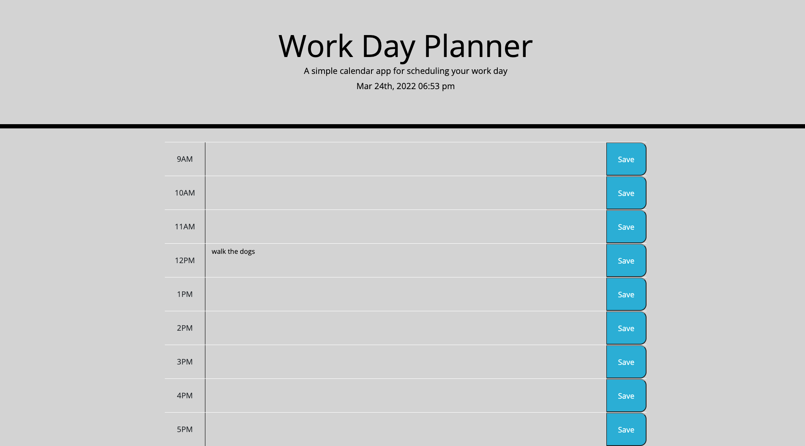

# work-day-planner

## Description

I made a day player to help you keep track of your day! You can type in your daily todo list in each time block and click save and it will keep your todo list save on your screen for you. There is live clock so you know what time of the day it currently is!  The time slot will appear red if the time slot matches the current time of the day. All time slots that have already happened will appear grey and all future time slots will appear green.

## Table of Contents (Optional)

- [Installation](#installation)
- [Usage](#usage)
- [Credits](#credits)
- [License](#license)

## Installation

No installation is required to run this application. 

## Usage

https://dev-dominick.github.io/work-day-planner/

## Credits

Isaak - https://github.com/CallMeIce
Kyle - https://github.com/kgiunta

## License

MIT License

Copyright (c) [2022] [Dominick Albano]

Permission is hereby granted, free of charge, to any person obtaining a copy of this software and associated documentation files (the "Software"), to deal in the Software without restriction, including without limitation the rights to use, copy, modify, merge, publish, distribute, sublicense, and/or sell copies of the Software, and to permit persons to whom the Software is furnished to do so, subject to the following conditions:

The above copyright notice and this permission notice shall be included in all copies or substantial portions of the Software.

THE SOFTWARE IS PROVIDED "AS IS", WITHOUT WARRANTY OF ANY KIND, EXPRESS OR IMPLIED, INCLUDING BUT NOT LIMITED TO THE WARRANTIES OF MERCHANTABILITY, FITNESS FOR A PARTICULAR PURPOSE AND NONINFRINGEMENT. IN NO EVENT SHALL THE AUTHORS OR COPYRIGHT HOLDERS BE LIABLE FOR ANY CLAIM, DAMAGES OR OTHER LIABILITY, WHETHER IN AN ACTION OF CONTRACT, TORT OR OTHERWISE, ARISING FROM, OUT OF OR IN CONNECTION WITH THE SOFTWARE OR THE USE OR OTHER DEALINGS IN THE SOFTWARE.

## Badges

N/A

## Features

N/A

## How to Contribute

N/A

## Tests

N/A